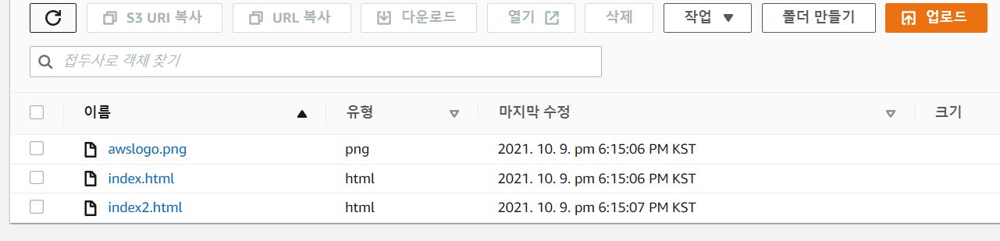

# 서버리스 웹 호스팅과 CloudFront로 웹 가속화 구현하기

## 아키텍처에 구현할 기술
- 서버가 없어도 구성이 가능한 정적 웹 호스팅을 만들고, 웹 속도를 높이기 위하여 콘텐츠 전송 네트워크(CDN) 서비스를 연동해요.
  
### 필요 AWS 서비스
- Amazon s3
- Amazon CloudFront

### 아키텍쳐 구현 순서
   **s3로 정적 웹 호스팅 구현하기**
   - s3 Bucket 생성
   - 정적 웹 사이트 호스팅 활성화
   - 웹 사이트 엔드포인트 테스트
  
   **CloudFront를 이용해 웹사이트 속도 높이기**
   - CloudFront 배포 만들기
   - 생성된 CloudFront 도메인 확인
 

## s3 - bucket
`s3`에서 `버킷`을 생성해야하는데 다른 값들은 모두 기본값으로 두고 `버킷의 이름`과 `리전`, 그리고 `엑서스 차단 설정`만 설정을 할게요.

**버킷 이름의 규칙**
- `버킷 이름`은 고유해야 하며 공백 또는 대문자를 포함할 수 없어요.
- 최소 3자 ~ 65자 사이
- 소문자, 숫자, '.', '-' 만 가능
- 버킷 이름의 규칙을 더 알고 싶으면 <a href = "https://docs.aws.amazon.com/AmazonS3/latest/userguide/bucketnamingrules.html">공식 문서</a>를 참고해주세요

**AWS 리전**  
  리전은 여러가지 국가가있지만 저는 한국에 살고있기 때문에 `서울 리전`으로 지정했어요.
  (다른 리전을 쓰시고 싶으시면 바꾸셔도 좋아요 😙)

**액세스 차단 설정** 
s3는 기본적으로 인터넷과 소통할 수 있는 대용량 객체 스토리지에요. 따라서 여기에서는 외부 인터넷과 s3로의 접속을 보호해주는 보안기능이 필요한데 이게 `액세스 차단 설정`이에요. 이번 실습에선 인터넷의 모든 접속을 풀어줄거기 때문에 체크박스를 해제했어요. 

**Bucket파일 업로드** 
버킷을 만들었으면 `정적 웹 사이트 호스팅` 설정을 해줘야해요. 
편집 버튼을 눌러서 활성화를 시켜주시고 인덱스 문서에 `index.html` 이라고 적어주고 저장해주세요.

**Bucket 정첵 수정** 
권한->버킷 정책->편집->정책 생성기를 클릭하시면 아래의 화면이 뜨는데 
- Select Type of Policy : `s3 Bucket Policy` 
- Principal : `* (모든 서비스를 사용하겠다) ` 
- Action : `어떠한 액션을 줄거냐인데 매우 많기에 이번엔 ALL Services를 체크해줍시다`
- Amazon Resource Name (ARN) : `전 화면에 나온 ARN 을 컨 c 컨v 해줍시다`

화면을 내려 `Generate Policy` 를 클릭하시면 아래처럼 `json`으로 변환되는데요

이걸 그대로 정책에다가 붙여넣기 해주시면돼요. 근데 저걸 그대로 입력하면 퍼징이 되지 않아요! 이걸 해결하기 위해선 `Resource` 뒤쪽에 `/*` 를 붙여주면 해결!

위의 과정을 다 하셨으면 업로드 버튼을 눌러 html 파일을 업로드해주세요!

업로드를 마치시고 버킷에 업로드한 파일을 클릭하신 다음 객체 URL 을 클릭하시면

짠! 업로드한 html이 나타납니다!

## Cloud Front
`배포 생성`을 누른 뒤 도메인을 선택해줘요. 클릭하면 아까 만든 버킷이 자동적으로 뜰건데 그걸 선택해주시면돼요.

이후 다른 설정들은 모두 기본값으로 설정하고 `배포 생성`을 눌러주세요

이제 클라우드 프론트로 불러오는 링크테스트를 하기 위해서 img 태그에 저희가 만든 도메인 네임을 넣어줘요.

(로고 이미지)

바꿔주시고 다시 `s3 bucket` 으로 가셔서 링크 테스트를 할 `html` 파일을 올려주세요 올리고 나서 들어가보면?

링크 테스트가 잘된걸 알 수 있습니다!

캐싱된 컨텐츠를 불러오는게 맞는지를 확인 하는 방법은 크롬 개발자 도구를 키시고 새로고침을 하시면 알 수 있어요!

## 글을 마치며
`처음써보는 TIL 이라 실습한걸 적어야하는지 강의식으로 적어야하는지 잘 몰라서 너무 중구난방으로으로 작성한 것 같네요..ㅋㅋ 더욱 노력하는 개발자가 되도록 하겠습니다! `
